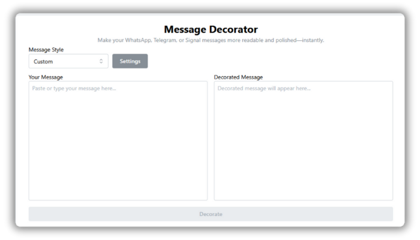

# 🎨 MessageDecor

**MessageDecor** is a lightweight LLM-powered web application that enhances the clarity, structure, and engagement of your broadcast messages—perfect for **WhatsApp**, **Telegram**, **Signal**, and other messengers.

✨ It automatically improves readability by:
- Adding **bold headlines**
- Highlighting 🔥 important phrases
- Inserting 📏 line breaks for better flow
- Enriching tone with relevant emojis 🎯✅🚀

The original message remains intact—only formatting is improved to boost communication impact. Ideal for **marketing**, **business announcements**, and **public messaging**!

## 💡 Example Use Case

Imagine you're sending a broadcast message like this:

> ```
> limited time sale ends soon get your discount now
> ```

MessageDecor transforms it into:

> ```
> 🔥 **LIMITED TIME SALE!**  
> ⏰ Ends Soon — Get Your **Discount Now** ✅  
> ```

## 🚀 Live Demo

Try it out here:  
👉 [messagedecor.joschabohn.de](https://messagedecor.joschabohn.de)

## 🛠️ Technologies Used

- ✅ **TypeScript**
- ✅ **React**
- ✅ **Mantine**
- ✅ **LangChain**
- ✅ **ChatGPT**
- ✅ **Vite**
- ✅ **Express.js**
